<p align="center">
  
</p>

<p align="center">
  High-performance charts powered by WebGPU
</p>

<div align="center">

[](https://github.com/hunterg325/ChartGPU/tree/main/examples)
[](https://github.com/hunterg325/ChartGPU/blob/main/docs/GETTING_STARTED.md)

[](https://www.npmjs.com/package/chartgpu)


[](https://www.npmjs.com/package/chartgpu)
[](https://github.com/hunterg325/ChartGPU/blob/main/LICENSE)
[](https://chartgpu.github.io/ChartGPU/)

[](https://news.ycombinator.com/item?id=46706528)

[](https://github.com/mikbry/awesome-webgpu)

</div>


ChartGPU is a TypeScript charting library built on WebGPU for smooth, interactive rendering—especially when you have lots of data.

## Highlights

- 🚀 WebGPU-accelerated rendering for high FPS with large datasets
- 📈 Multiple series types: line, area, bar, scatter, pie, candlestick
- 🌡️ Scatter density/heatmap mode (`mode: 'density'`) for large point clouds — see [`docs/api/options.md#scatterseriesconfig`](docs/api/options.md#scatterseriesconfig) and [`examples/scatter-density-1m/`](examples/scatter-density-1m/)
- 📍 Annotation overlays: reference lines (horizontal/vertical), point markers, and text labels — see [`docs/api/options.md#annotations`](docs/api/options.md#annotations) and [`examples/annotations/`](examples/annotations/)
- 🧭 Built-in interaction: hover highlight, tooltip, crosshair
- 🔁 Streaming updates via y-`appendData(...)` with typed-array support (`XYArraysData`, `InterleavedXYData`, `DataPoint[]`) — see [`examples/cartesian-data-formats/`](examples/cartesian-data-formats/)
- 🔍 X-axis zoom (inside gestures + optional slider UI)
- 🎛️ Theme presets (`'dark' | 'light'`) and custom theme support


## Architecture

At a high level, `ChartGPU.create(...)` owns the canvas + WebGPU lifecycle, and delegates render orchestration (layout/scales/data upload/render passes + internal overlays) to the render coordinator. For deeper internal notes, see [`docs/api/INTERNALS.md`](https://github.com/hunterg325/ChartGPU/blob/main/docs/api/INTERNALS.md) (especially "Render coordinator").

```mermaid
flowchart TB
  UserApp["Consumer app"] --> PublicAPI["src/index.ts (Public API exports)"]

  PublicAPI --> ChartCreate["ChartGPU.create(container, options)"]
  PublicAPI --> SyncAPI["connectCharts(charts)"]

  subgraph MainThread["🔷 MAIN THREAD RENDERING (Default)"]
    subgraph ChartInstance["Chart instance (src/ChartGPU.ts)"]
      ChartCreate --> SupportCheck["checkWebGPUSupport()"]
      ChartCreate --> Canvas["Create canvas + mount into container"]
      ChartCreate --> Options["resolveOptionsForChart(options)<br/>(adds bottom reserve when slider present)"]
      ChartCreate --> GPUInit["GPUContext.create(canvas)"]
      ChartCreate --> Coordinator["createRenderCoordinator(gpuContext, resolvedOptions)"]

      ChartCreate --> InstanceAPI["ChartGPUInstance APIs"]
      InstanceAPI --> RequestRender["requestAnimationFrame (coalesced)"]
      RequestRender --> Coordinator

      InstanceAPI --> SetOption["setOption(...)"]
      InstanceAPI --> AppendData["appendData(...)<br/>(XYArraysData | InterleavedXYData | DataPoint[])"]
      InstanceAPI --> Resize["resize()"]

      subgraph PublicEvents["Public events + hit-testing (ChartGPU.ts)"]
        Canvas --> PointerHandlers["Pointer listeners"]
        PointerHandlers --> PublicHitTest["findNearestPoint() / findPieSlice()<br/>(with internal visibility filtering)"]
        PointerHandlers --> EmitEvents["emit('click'/'mouseover'/'mouseout')"]
      end

      DataZoomSlider["dataZoom slider (absolute-positioned DOM overlay)<br/>chart reserves bottom space for x-axis"] --> Coordinator
    end

    subgraph WebGPUCore["WebGPU core (src/core/GPUContext.ts)"]
      GPUInit --> AdapterDevice["navigator.gpu.requestAdapter/device"]
      GPUInit --> CanvasConfig["canvasContext.configure(format)"]
    end

    subgraph RenderCoordinatorLayer["Render coordinator (src/core/createRenderCoordinator.ts)<br/>Modular architecture with specialized modules"]
      subgraph CoordModules["Coordinator modules (src/core/renderCoordinator/*)"]
        Utils["utils/ - Canvas, bounds, axes, time formatting"]
        GPU["gpu/ - Texture management, MSAA"]
        Renderers["renderers/ - Renderer pool management"]
        DataMods["data/ - Visible slice computation"]
        Zoom["zoom/ - Zoom state utilities"]
        Anim["animation/ - Animation helpers"]
        Interact["interaction/ - Pointer & hit-testing"]
        UI["ui/ - Tooltip & legend helpers"]
        AxisMods["axis/ - Tick computation & labels"]
        Annot["annotations/ - Annotation processing"]
        Render["render/ - Series, overlays, labels"]
      end

      Coordinator --> CoordModules

      Coordinator --> Layout["GridArea layout"]
      Coordinator --> Scales["xScale/yScale (clip space for render)"]
      Coordinator --> DataUpload["createDataStore(device) (GPU buffer upload/caching)"]
      Coordinator --> DensityCompute["Encode + submit compute pass<br/>(scatter density mode)"]
      DensityCompute --> RenderPass["Encode + submit render pass"]

      subgraph InternalOverlays["Internal interaction overlays (coordinator)"]
        Coordinator --> Events["createEventManager(canvas, gridArea)"]
        Events --> OverlayHitTest["hover/tooltip hit-testing<br/>(hit-testing functions filter<br/>for visible series internally)"]
        Events --> InteractionX["interaction-x state (crosshair)"]
        Coordinator --> OverlaysDOM["DOM overlays: legend / tooltip / text labels / annotation labels"]
      end
    end
  end

  subgraph Renderers["GPU renderers (src/renderers/*)"]
    RenderPass --> GridR["Grid"]
    RenderPass --> AreaR["Area"]
    RenderPass --> BarR["Bar"]
    RenderPass --> ScatterR["Scatter"]
    RenderPass --> ScatterDensityR["Scatter density/heatmap"]
    RenderPass --> LineR["Line"]
    RenderPass --> PieR["Pie"]
    RenderPass --> CandlestickR["Candlestick"]
    RenderPass --> ReferenceLineR["Reference lines"]
    RenderPass --> AnnotationMarkerR["Annotation markers"]
    RenderPass --> CrosshairR["Crosshair overlay"]
    RenderPass --> HighlightR["Hover highlight overlay"]
    RenderPass --> AxisR["Axes/ticks"]
  end

  subgraph Shaders["WGSL shaders (src/shaders/*)"]
    GridR --> gridWGSL["grid.wgsl"]
    AreaR --> areaWGSL["area.wgsl"]
    BarR --> barWGSL["bar.wgsl"]
    ScatterR --> scatterWGSL["scatter.wgsl"]
    ScatterDensityR --> scatterDensityBinningWGSL["scatterDensityBinning.wgsl"]
    ScatterDensityR --> scatterDensityColormapWGSL["scatterDensityColormap.wgsl"]
    LineR --> lineWGSL["line.wgsl"]
    PieR --> pieWGSL["pie.wgsl"]
    CandlestickR --> candlestickWGSL["candlestick.wgsl"]
    ReferenceLineR --> referenceLineWGSL["referenceLine.wgsl"]
    AnnotationMarkerR --> annotationMarkerWGSL["annotationMarker.wgsl"]
    CrosshairR --> crosshairWGSL["crosshair.wgsl"]
    HighlightR --> highlightWGSL["highlight.wgsl"]
  end

  subgraph ChartSync["Chart sync (src/interaction/createChartSync.ts)"]
    SyncAPI --> ListenX["listen: 'crosshairMove'"]
    SyncAPI --> DriveX["setCrosshairX(...) on peers"]
    SyncAPI -. "optional" .-> ListenZoom["listen: 'zoomRangeChange'"]
    SyncAPI -. "optional" .-> DriveZoom["setZoomRange(...) on peers"]
  end

  InteractionX --> ListenX
  DriveX --> InstanceAPI
```



### 35M points (benchmark)

35,000,000 points rendered at ~72 FPS (benchmark mode).


## Demo


### Candlestick Charts

Financial OHLC (open-high-low-close) candlestick rendering with classic/hollow style toggle and color customization. The live streaming demo renders **5 million candlesticks at over 100 FPS** with real-time updates.


### Scatter Density (1M points)

GPU-binned density/heatmap mode for scatter plots (`mode: 'density'`) to reveal structure in overplotted point clouds. See [`docs/api/options.md#scatterseriesconfig`](docs/api/options.md#scatterseriesconfig) and the demo in [`examples/scatter-density-1m/`](examples/scatter-density-1m/).


### Interactive Annotation Authoring

Full-featured annotation authoring system with interactive editing capabilities. Create, edit, drag, and delete annotations with an intuitive UI. Supports all annotation types: reference lines (horizontal/vertical), point markers, text annotations (plot-space + data-space tracking), labels, and styling options.


**Key features:**
- **Right-click empty space** → Add vertical/horizontal line or text note with custom color, style & label
- **Click & drag annotations** → Reposition them (lines constrained to their axis)
- **Right-click on annotation** → Edit properties or delete
- **Full styling control** → Color picker, line style (solid/dashed), line width, and label customization
- **Undo/Redo support** → All annotations are reversible
- **Scroll to zoom, Drag to pan** → Standard chart interactions work seamlessly


The annotation authoring system is demonstrated in the [`examples/annotation-authoring/`](examples/annotation-authoring/) example.

## Quick start

```ts
import { ChartGPU } from 'chartgpu';
const container = document.getElementById('chart')!;
await ChartGPU.create(container, {
  series: [{ type: 'line', data: [[0, 1], [1, 3], [2, 2]] }],
});
```

### Annotations

Add reference lines, point markers, and text overlays to highlight important data features:

```ts
await ChartGPU.create(container, {
  series: [{ type: 'line', data: [[0, 1], [1, 3], [2, 2]] }],
  annotations: [
    // Horizontal reference line
    {
      id: 'ref-y',
      type: 'lineY',
      y: 2.5,
      layer: 'belowSeries',
      style: { color: '#ffd166', lineWidth: 2, lineDash: [8, 6], opacity: 0.95 },
      label: { text: 'threshold' },
    },
    // Point marker at peak
    {
      id: 'peak',
      type: 'point',
      x: 1,
      y: 3,
      layer: 'aboveSeries',
      marker: { symbol: 'circle', size: 8, style: { color: '#ff4ab0' } },
      label: { template: 'peak={y}', decimals: 2 },
    },
  ],
});
```

See [Annotations Documentation](https://github.com/hunterg325/ChartGPU/blob/main/docs/api/options.md#annotations) and the [annotations example](https://github.com/hunterg325/ChartGPU/tree/main/examples/annotation-authoring).

## Installation

`npm install chartgpu`

## React Integration

React bindings are available via [`chartgpu-react`](https://github.com/ChartGPU/chartgpu-react):

```bash
npm install chartgpu-react
```

```tsx
import { ChartGPUChart } from 'chartgpu-react';

function MyChart() {
  return (
    <ChartGPUChart
      options={{
        series: [{ type: 'line', data: [[0, 1], [1, 3], [2, 2]] }],
      }}
    />
  );
}
```

See the [chartgpu-react repository](https://github.com/ChartGPU/chartgpu-react) for full documentation and examples.

## Browser support (WebGPU required)

- Chrome 113+ or Edge 113+ (WebGPU enabled by default)
- Safari 18+ (WebGPU enabled by default)
- Firefox: Windows 114+, Mac 145+, Linux nightly

See the [gpuweb repository](https://github.com/gpuweb/gpuweb/wiki/Implementation-Status) for full Implementation Status

## Documentation

- Full documentation: [Getting Started](https://github.com/hunterg325/ChartGPU/blob/main/docs/GETTING_STARTED.md)
- API reference: [`docs/api/README.md`](https://github.com/hunterg325/ChartGPU/blob/main/docs/api/README.md)

## Examples

- Browse examples: [`examples/`](https://github.com/hunterg325/ChartGPU/tree/main/examples)
- Run locally:
  - `npm install`
  - `npm run dev` (opens `http://localhost:5173/examples/`)

## Contributing

See [`CONTRIBUTING.md`](https://github.com/hunterg325/ChartGPU/blob/main/CONTRIBUTING.md).

## License

MIT — see [`LICENSE`](https://github.com/hunterg325/ChartGPU/blob/main/LICENSE).
