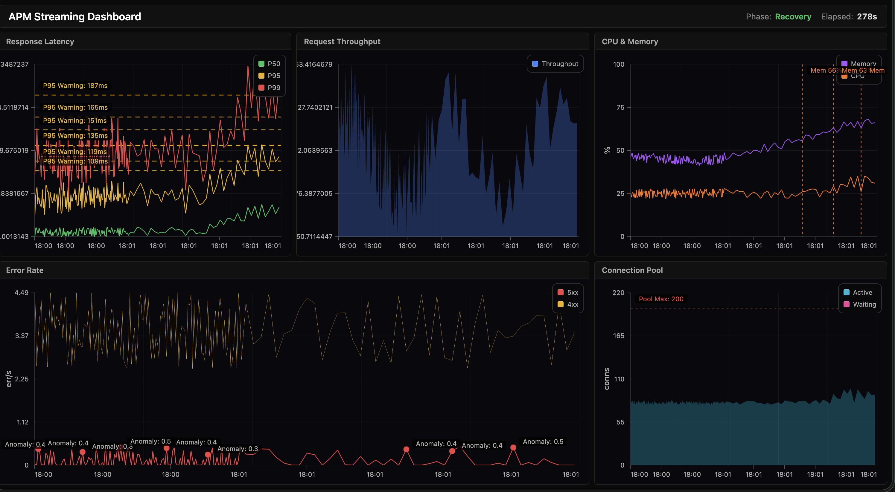
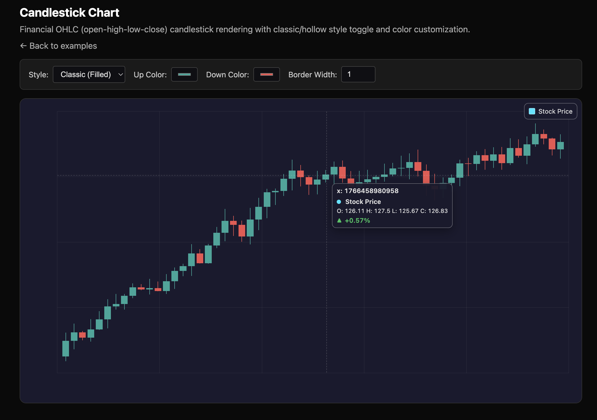

<p align="center" style="margin-bottom:0; margin-top:20px;">
  
</p>

<p align="center" style="margin-top:-18px;">
  The fastest open-source charting library — 50M points at 60 FPS.
</p>

<div align="center">


[](https://forthebadge.com)
[](https://github.com/chartgpu/chartgpu)
[](https://github.com/chartgpu/chartgpu/actions/workflows/tests.yml)
[](https://www.npmjs.com/package/chartgpu)
[](https://www.npmjs.com/package/chartgpu)
[](https://github.com/chartgpu/chartgpu/blob/main/LICENSE)
[](https://chartgpu.github.io/ChartGPU/examples/)
[](https://github.com/chartgpu/chartgpu/tree/main/examples)
[](https://github.com/chartgpu/chartgpu/blob/main/docs/GETTING_STARTED.md)

[](https://news.ycombinator.com/item?id=46706528)

[](https://github.com/mikbry/awesome-webgpu)


</div>

ChartGPU is a TypeScript charting library built on WebGPU for smooth, interactive rendering—especially when you have lots of data.

## Demo


### Streaming Multi-Chart Dashboard

Five live charts. Annotations ticking in real time. Latency percentiles, throughput, error rates, resource utilization — all streaming simultaneously at 60 FPS on a single shared `GPUDevice`. This is what ChartGPU was built for.

Want to build your own? Check out the [Multi-Chart Dashboard Cookbook](docs/guides/multichart-dashboard-cookbook.md) for hands-on recipes and tips to get started!



### 35M points (benchmark)

35,000,000 points rendered at ~72 FPS (benchmark mode).


## Quick Start

```ts
import { ChartGPU } from 'chartgpu';
const container = document.getElementById('chart')!;
await ChartGPU.create(container, {
  series: [{ type: 'line', data: [[0, 1], [1, 3], [2, 2]] }],
});
```

### Annotations

Add reference lines, point markers, and text overlays to highlight important data features:

```ts
await ChartGPU.create(container, {
  series: [{ type: 'line', data: [[0, 1], [1, 3], [2, 2]] }],
  annotations: [
    // Horizontal reference line
    {
      id: 'ref-y',
      type: 'lineY',
      y: 2.5,
      layer: 'belowSeries',
      style: { color: '#ffd166', lineWidth: 2, lineDash: [8, 6], opacity: 0.95 },
      label: { text: 'threshold' },
    },
    // Point marker at peak
    {
      id: 'peak',
      type: 'point',
      x: 1,
      y: 3,
      layer: 'aboveSeries',
      marker: { symbol: 'circle', size: 8, style: { color: '#ff4ab0' } },
      label: { template: 'peak={y}', decimals: 2 },
    },
  ],
});
```

See [Annotations Documentation](https://github.com/chartgpu/chartgpu/blob/main/docs/api/options.md#annotations) and the [annotations example](https://github.com/chartgpu/chartgpu/tree/main/examples/annotation-authoring).

## Highlights

- 🚀 WebGPU-accelerated rendering for high FPS with large datasets
- 📈 Multiple series types: line, area, bar, scatter, pie, candlestick
- 🌡️ Scatter density/heatmap mode (`mode: 'density'`) for large point clouds — see [`docs/api/options.md#scatterseriesconfig`](docs/api/options.md#scatterseriesconfig) and [`examples/scatter-density-1m/`](examples/scatter-density-1m/)
- 📍 Annotation overlays: reference lines (horizontal/vertical), point markers, and text labels — see [`docs/api/options.md#annotations`](docs/api/options.md#annotations) and [`examples/annotations/`](examples/annotations/)
- 🧭 Built-in interaction: hover highlight, tooltip, crosshair
- 🔁 Streaming updates via `appendData(...)` with typed-array support (`XYArraysData`, `InterleavedXYData`, `DataPoint[]`) — see [`examples/cartesian-data-formats/`](examples/cartesian-data-formats/)
- 🔍 X-axis zoom (inside gestures + optional slider UI)
- 🎛️ Theme presets (`'dark' | 'light'`) and custom theme support
- 🔗 Shared GPUDevice support for multi-chart dashboards (efficient GPU resource management) — see [`docs/api/chart.md#shared-gpudevice`](docs/api/chart.md#shared-gpudevice)
- 🧱 Shared pipeline cache for multi-chart dashboards (dedupe shader modules + render pipelines across charts) — see [`docs/api/chart.md#pipeline-cache-cgpu-pipeline-cache`](docs/api/chart.md#pipeline-cache-cgpu-pipeline-cache)


### Candlestick Charts

Financial OHLC (open-high-low-close) candlestick rendering with classic/hollow style toggle and color customization. The live streaming demo renders **5 million candlesticks at over 100 FPS** with real-time updates.



### Scatter Density (1M points)

GPU-binned density/heatmap mode for scatter plots (`mode: 'density'`) to reveal structure in overplotted point clouds. See [`docs/api/options.md#scatterseriesconfig`](docs/api/options.md#scatterseriesconfig) and the demo in [`examples/scatter-density-1m/`](examples/scatter-density-1m/).


### Interactive Annotation Authoring

Full-featured annotation authoring system with interactive editing capabilities. Create, edit, drag, and delete annotations with an intuitive UI. Supports all annotation types: reference lines (horizontal/vertical), point markers, text annotations (plot-space + data-space tracking), labels, and styling options.


**Key features:**
- **Right-click empty space** → Add vertical/horizontal line or text note with custom color, style & label
- **Click & drag annotations** → Reposition them (lines constrained to their axis)
- **Right-click on annotation** → Edit properties or delete
- **Full styling control** → Color picker, line style (solid/dashed), line width, and label customization
- **Undo/Redo support** → All annotations are reversible
- **Scroll to zoom, Drag to pan** → Standard chart interactions work seamlessly


The annotation authoring system is demonstrated in the [`examples/annotation-authoring/`](examples/annotation-authoring/) example.

## Installation

```bash
npm install chartgpu
```

**GitHub Packages:**

```bash
npm install @chartgpu/chartgpu
```

For GitHub Packages, configure your `.npmrc`:

```
@chartgpu:registry=https://npm.pkg.github.com
```

## React Integration

React bindings are available via [`chartgpu-react`](https://github.com/ChartGPU/chartgpu-react):

```bash
npm install chartgpu-react
```

```tsx
import { ChartGPUChart } from 'chartgpu-react';

function MyChart() {
  return (
    <ChartGPUChart
      options={{
        series: [{ type: 'line', data: [[0, 1], [1, 3], [2, 2]] }],
      }}
    />
  );
}
```

See the [chartgpu-react repository](https://github.com/ChartGPU/chartgpu-react) for full documentation and examples.

## Browser support (WebGPU required)

- Chrome 113+ or Edge 113+ (WebGPU enabled by default)
- Safari 18+ (WebGPU enabled by default)
- Firefox: Windows 114+, Mac 145+, Linux nightly

See the [gpuweb repository](https://github.com/gpuweb/gpuweb/wiki/Implementation-Status) for full Implementation Status

## Who's Using ChartGPU

ChartGPU is a young project and we'd love to hear how you're using it! If your team or project uses ChartGPU, [open a pull request](https://github.com/chartgpu/chartgpu/pulls) to add your name here.

<!-- Add your project/company below:
- [Your Project](https://link) — short description
-->

## Documentation

- Full documentation: [Getting Started](https://github.com/chartgpu/chartgpu/blob/main/docs/GETTING_STARTED.md)
- API reference: [`docs/api/README.md`](https://github.com/chartgpu/chartgpu/blob/main/docs/api/README.md)

## Examples

- Browse examples: [`examples/`](https://github.com/chartgpu/chartgpu/tree/main/examples)
- Run locally:
  - `npm install`
  - `npm run dev` (opens `http://localhost:5173/examples/`)

## Contributing

See [`CONTRIBUTING.md`](https://github.com/chartgpu/chartgpu/blob/main/CONTRIBUTING.md).

## License

MIT — see [`LICENSE`](https://github.com/chartgpu/chartgpu/blob/main/LICENSE).

## Architecture

ChartGPU follows a functional-first architecture. `ChartGPU.create(...)` owns the canvas and WebGPU lifecycle, delegating render orchestration to a modular render coordinator with 11 specialized modules.

For the full architecture diagram, see [`docs/ARCHITECTURE.md`](docs/ARCHITECTURE.md). For deep internal notes, see [`docs/api/INTERNALS.md`](docs/api/INTERNALS.md).