<p align="center">
  
</p>

<p align="center">
  High-performance charts powered by WebGPU
</p>

<p align="center">
  <a href="https://github.com/hunterg325/ChartGPU/blob/main/docs/GETTING_STARTED.md">Documentation</a> |
  <a href="https://chartgpu.github.io/ChartGPU/">Live Demo</a> |
  <a href="https://github.com/hunterg325/ChartGPU/tree/main/examples">Examples</a>
</p>

<p align="center">
  <a href="https://www.npmjs.com/package/chartgpu" style="text-decoration: none;">
    
  </a>
  <a href="https://github.com/hunterg325/ChartGPU/blob/main/LICENSE" style="text-decoration: none;">
    
  </a>
  <a href="https://chartgpu.github.io/ChartGPU/" style="text-decoration: none;">
    
  </a>
</p>

ChartGPU is a TypeScript charting library built on WebGPU for smooth, interactive rendering—especially when you have lots of data.

## Highlights

- 🚀 WebGPU-accelerated rendering for high FPS with large datasets
- 📈 Multiple series types: line, area, bar, scatter, pie, candlestick
- 🧭 Built-in interaction: hover highlight, tooltip, crosshair
- 🔁 Streaming updates via `appendData(...)` (cartesian series)
- 🔍 X-axis zoom (inside gestures + optional slider UI)
- 🎛️ Theme presets (`'dark' | 'light'`) and custom theme support

## Architecture

At a high level, `ChartGPU.create(...)` owns the canvas + WebGPU lifecycle, and delegates render orchestration (layout/scales/data upload/render passes + internal overlays) to the render coordinator. For deeper internal notes, see [`docs/api/INTERNALS.md`](https://github.com/hunterg325/ChartGPU/blob/main/docs/api/INTERNALS.md) (especially “Render coordinator”).

```mermaid
flowchart TB
  UserApp["Consumer app"] --> PublicAPI["src/index.ts (Public API exports)"]

  PublicAPI --> ChartCreate["ChartGPU.create(container, options)"]
  PublicAPI --> SyncAPI["connectCharts(charts)"]

  subgraph MainThread["🔷 MAIN THREAD RENDERING (Default)"]
    subgraph ChartInstance["Chart instance (src/ChartGPU.ts)"]
      ChartCreate --> SupportCheck["checkWebGPUSupport()"]
      ChartCreate --> Canvas["Create canvas + mount into container"]
      ChartCreate --> Options["resolveOptions(options)"]
      ChartCreate --> GPUInit["GPUContext.create(canvas)"]
      ChartCreate --> Coordinator["createRenderCoordinator(gpuContext, resolvedOptions)"]

      ChartCreate --> InstanceAPI["ChartGPUInstance APIs"]
      InstanceAPI --> RequestRender["requestAnimationFrame (coalesced)"]
      RequestRender --> Coordinator

      InstanceAPI --> SetOption["setOption(...)"]
      InstanceAPI --> AppendData["appendData(...)"]
      InstanceAPI --> Resize["resize()"]

      subgraph PublicEvents["Public events + hit-testing (ChartGPU.ts)"]
        Canvas --> PointerHandlers["Pointer listeners"]
        PointerHandlers --> PublicHitTest["findNearestPoint() / findPieSlice()"]
        PointerHandlers --> EmitEvents["emit('click'/'mouseover'/'mouseout')"]
      end

      DataZoomSlider["dataZoom slider UI (DOM)"] --> Coordinator
    end

    subgraph WebGPUCore["WebGPU core (src/core/GPUContext.ts)"]
      GPUInit --> AdapterDevice["navigator.gpu.requestAdapter/device"]
      GPUInit --> CanvasConfig["canvasContext.configure(format)"]
    end

    subgraph RenderCoordinatorLayer["Render coordinator (src/core/createRenderCoordinator.ts)"]
      Coordinator --> Layout["GridArea layout"]
      Coordinator --> Scales["xScale/yScale (clip space for render)"]
      Coordinator --> DataUpload["createDataStore(device) (GPU buffer upload/caching)"]
      Coordinator --> RenderPass["Encode + submit render pass"]

      subgraph InternalOverlays["Internal interaction overlays (coordinator)"]
        Coordinator --> Events["createEventManager(canvas, gridArea)"]
        Events --> OverlayHitTest["hover/tooltip hit-testing"]
        Events --> InteractionX["interaction-x state (crosshair)"]
        Coordinator --> OverlaysDOM["DOM overlays: legend / tooltip / text labels"]
      end
    end
  end

  subgraph WorkerThread["⚡ WORKER THREAD RENDERING (Optional - src/worker/)"]
    subgraph WorkerInbound["Main → Worker (src/worker/protocol.ts)"]
      MainAPI["ChartGPU.createWorker(...)"] -->|"postMessage: init"| WorkerInit["InitMessage + OffscreenCanvas transfer"]
      MainAPI -->|"postMessage: setOption"| WorkerSetOpt["SetOptionMessage"]
      MainAPI -->|"postMessage: appendData"| WorkerAppend["AppendDataMessage + ArrayBuffer transfer"]
      MainAPI -->|"postMessage: resize"| WorkerResize["ResizeMessage"]
      MainAPI -->|"postMessage: forwardPointerEvent"| WorkerPointer["ForwardPointerEventMessage"]
      MainAPI -->|"postMessage: setZoomRange"| WorkerZoom["SetZoomRangeMessage"]
      MainAPI -->|"postMessage: setInteractionX"| WorkerInteractionX["SetInteractionXMessage"]
      MainAPI -->|"postMessage: dispose"| WorkerDispose["DisposeMessage"]
    end

    subgraph WorkerCore["Worker context (src/worker/index.ts)"]
      WorkerInit --> WGPUInit["GPUContext.create(offscreenCanvas)"]
      WGPUInit --> WCoordinator["createRenderCoordinator(gpuContext, options)"]
      WCoordinator --> WRenderLoop["requestAnimationFrame loop"]
      WorkerSetOpt --> WCoordinator
      WorkerAppend --> WDataStore["Worker DataStore (GPU buffer upload)"]
      WorkerResize --> WCoordinator
      WorkerPointer --> WHitTest["Worker hit-testing"]
      WorkerZoom --> WCoordinator
      WorkerInteractionX --> WCoordinator
      WorkerDispose --> WCleanup["Resource cleanup"]
    end

    subgraph WorkerOutbound["Worker → Main (postMessage)"]
      WGPUInit -->|"ready"| ReadyMsg["ReadyMessage + GPU capabilities"]
      WRenderLoop -->|"rendered"| RenderedMsg["RenderedMessage (frame stats)"]
      WHitTest -->|"tooltipUpdate"| TooltipMsg["TooltipUpdateMessage"]
      WCoordinator -->|"legendUpdate"| LegendMsg["LegendUpdateMessage"]
      WCoordinator -->|"axisLabelsUpdate"| AxisMsg["AxisLabelsUpdateMessage"]
      WHitTest -->|"hoverChange"| HoverMsg["HoverChangeMessage"]
      WHitTest -->|"click"| ClickMsg["ClickMessage"]
      WHitTest -->|"crosshairMove"| CrosshairMsg["CrosshairMoveMessage"]
      WCoordinator -->|"zoomChange"| ZoomMsg["ZoomChangeMessage"]
      WGPUInit -->|"deviceLost"| DeviceLostMsg["DeviceLostMessage"]
      WCleanup -->|"disposed"| DisposedMsg["DisposedMessage"]
      WCoordinator -->|"error"| ErrorMsg["ErrorMessage"]
    end

    subgraph MainThreadDOM["Main thread receives & renders DOM overlays"]
      ReadyMsg --> DOMReady["Chart ready event"]
      TooltipMsg --> DOMTooltip["Update tooltip DOM"]
      LegendMsg --> DOMLegend["Update legend DOM"]
      AxisMsg --> DOMAxis["Update axis labels DOM"]
      HoverMsg --> DOMHover["Emit hover event"]
      ClickMsg --> DOMClick["Emit click event"]
      CrosshairMsg --> DOMCrosshair["Update crosshair display"]
      ZoomMsg --> DOMZoom["Emit zoom event"]
    end
  end

  subgraph Renderers["GPU renderers (src/renderers/*)"]
    RenderPass --> GridR["Grid"]
    RenderPass --> AreaR["Area"]
    RenderPass --> BarR["Bar"]
    RenderPass --> ScatterR["Scatter"]
    RenderPass --> LineR["Line"]
    RenderPass --> PieR["Pie"]
    RenderPass --> CandlestickR["Candlestick"]
    RenderPass --> CrosshairR["Crosshair overlay"]
    RenderPass --> HighlightR["Hover highlight overlay"]
    RenderPass --> AxisR["Axes/ticks"]

    WRenderLoop --> GridR
  end

  subgraph Shaders["WGSL shaders (src/shaders/*)"]
    GridR --> gridWGSL["grid.wgsl"]
    AreaR --> areaWGSL["area.wgsl"]
    BarR --> barWGSL["bar.wgsl"]
    ScatterR --> scatterWGSL["scatter.wgsl"]
    LineR --> lineWGSL["line.wgsl"]
    PieR --> pieWGSL["pie.wgsl"]
    CandlestickR --> candlestickWGSL["candlestick.wgsl"]
    CrosshairR --> crosshairWGSL["crosshair.wgsl"]
    HighlightR --> highlightWGSL["highlight.wgsl"]
  end

  subgraph ChartSync["Chart sync (src/interaction/createChartSync.ts)"]
    SyncAPI --> ListenX["listen: 'crosshairMove'"]
    SyncAPI --> DriveX["setCrosshairX(...) on peers"]
  end

  InteractionX --> ListenX
  DriveX --> InstanceAPI
  CrosshairMsg --> ListenX
```



## Demo


### Candlestick Charts

Financial OHLC (open-high-low-close) candlestick rendering with classic/hollow style toggle and color customization. The live streaming demo renders **5 million candlesticks at over 100 FPS** with real-time updates.


## Quick start

```ts
import { ChartGPU } from 'chartgpu';
const container = document.getElementById('chart')!;
await ChartGPU.create(container, {
  series: [{ type: 'line', data: [[0, 1], [1, 3], [2, 2]] }],
});
```

## Installation

`npm install chartgpu`

## React Integration

React bindings are available via [`chartgpu-react`](https://github.com/ChartGPU/chartgpu-react):

```bash
npm install chartgpu-react
```

```tsx
import { ChartGPUChart } from 'chartgpu-react';

function MyChart() {
  return (
    <ChartGPUChart
      options={{
        series: [{ type: 'line', data: [[0, 1], [1, 3], [2, 2]] }],
      }}
    />
  );
}
```

See the [chartgpu-react repository](https://github.com/ChartGPU/chartgpu-react) for full documentation and examples.

## Browser support (WebGPU required)

- Chrome 113+ or Edge 113+ (WebGPU enabled by default)
- Safari 18+ (WebGPU enabled by default)
- Firefox: not supported (WebGPU support in development)

## Documentation

- Full documentation: [Getting Started](https://github.com/hunterg325/ChartGPU/blob/main/docs/GETTING_STARTED.md)
- API reference: [`docs/api/README.md`](https://github.com/hunterg325/ChartGPU/blob/main/docs/api/README.md)

## Examples

- Browse examples: [`examples/`](https://github.com/hunterg325/ChartGPU/tree/main/examples)
- Run locally:
  - `npm install`
  - `npm run dev` (opens `http://localhost:5176/examples/`)

## Contributing

See [`CONTRIBUTING.md`](https://github.com/hunterg325/ChartGPU/blob/main/CONTRIBUTING.md).

## License

MIT — see [`LICENSE`](https://github.com/hunterg325/ChartGPU/blob/main/LICENSE).
