# Architecture

ChartGPU follows a **functional-first architecture**:

- **Core rendering**: Functional APIs in `GPUContext`, `RenderScheduler`
- **Chart API**: `ChartGPU.create()` factory pattern
- **Options**: Deep-merge resolution via `resolveOptions()`
- **Renderers**: Internal pipeline-based renderers for each series type
- **Interaction**: Event-driven with render-on-demand scheduling
- **Render modes**: `'auto'` (internal rAF loop) or `'external'` (application-driven via `renderFrame()`)
- **Render coordinator**: Modular architecture with 11 specialized modules under `src/core/renderCoordinator/` (see [INTERNALS.md](api/INTERNALS.md))

## Architecture Diagram

At a high level, `ChartGPU.create(...)` owns the canvas + WebGPU lifecycle, and delegates render orchestration (layout/scales/data upload/render passes + internal overlays) to the render coordinator. Charts can render via an internal `requestAnimationFrame` loop (`'auto'` mode, the default), or be driven externally by calling `renderFrame()` from an application-controlled loop (`'external'` mode).

```mermaid
flowchart TB
  UserApp["Consumer app"] --> PublicAPI["src/index.ts - Public API exports"]

  PublicAPI --> ChartCreate["ChartGPU.create(container, options)"]
  PublicAPI --> SyncAPI["connectCharts(charts)"]

  subgraph MainThread["Main Thread Rendering - Default"]
    subgraph ChartInstance["Chart instance - src/ChartGPU.ts"]
      ChartCreate --> SupportCheck["checkWebGPUSupport()"]
      ChartCreate --> Canvas["Create canvas + mount into container"]
      ChartCreate --> Options["resolveOptionsForChart(options) - adds bottom reserve when slider present"]
      ChartCreate --> GPUInit["GPUContext.create(canvas)"]
      ChartCreate --> Coordinator["createRenderCoordinator(gpuContext, resolvedOptions)"]

      ChartCreate --> InstanceAPI["ChartGPUInstance APIs"]
      InstanceAPI --> RequestRender["requestAnimationFrame - coalesced (auto mode)"]
      RequestRender --> Coordinator
      InstanceAPI --> RenderFrame["renderFrame() - synchronous (external mode)"]
      RenderFrame --> Coordinator

      InstanceAPI --> SetOption["setOption(...)"]
      InstanceAPI --> AppendData["appendData(...) - XYArraysData, InterleavedXYData, DataPoint"]
      InstanceAPI --> Resize["resize()"]
      InstanceAPI --> SetRenderMode["setRenderMode('auto' | 'external')"]
      InstanceAPI --> NeedsRender["needsRender() - dirty flag"]

      subgraph PublicEvents["Public events + hit-testing"]
        Canvas --> PointerHandlers["Pointer listeners"]
        PointerHandlers --> PublicHitTest["findNearestPoint / findPieSlice - visibility filtering"]
        PointerHandlers --> EmitEvents["emit click / mouseover / mouseout"]
      end

      DataZoomSlider["dataZoom slider - DOM overlay, reserves bottom space"] --> Coordinator
    end

    subgraph WebGPUCore["WebGPU core - src/core/GPUContext.ts"]
      GPUInit --> AdapterDevice["navigator.gpu.requestAdapter/device"]
      GPUInit --> CanvasConfig["canvasContext.configure(format)"]
    end

    subgraph RenderCoordinatorLayer["Render coordinator - createRenderCoordinator.ts"]
      subgraph CoordModules["Coordinator modules - src/core/renderCoordinator/*"]
        Utils["utils/ - Canvas, bounds, axes, time formatting"]
        GPU["gpu/ - Texture management, MSAA"]
        RenderersModule["renderers/ - Renderer pool management"]
        DataMods["data/ - Visible slice computation"]
        Zoom["zoom/ - Zoom state utilities"]
        Anim["animation/ - Animation helpers"]
        Interact["interaction/ - Pointer and hit-testing"]
        UI["ui/ - Tooltip and legend helpers"]
        AxisMods["axis/ - Tick computation and labels"]
        Annot["annotations/ - Annotation processing"]
        Render["render/ - Series, overlays, labels"]
      end

      Coordinator --> CoordModules

      Coordinator --> Layout["GridArea layout"]
      Coordinator --> Scales["xScale/yScale - clip space for render"]
      Coordinator --> DataUpload["createDataStore(device) - GPU buffer upload/caching"]
      Coordinator --> DensityCompute["Encode + submit compute pass - scatter density mode"]
      DensityCompute --> RenderPass["Encode + submit render pass"]

      subgraph InternalOverlays["Internal interaction overlays"]
        Coordinator --> Events["createEventManager(canvas, gridArea)"]
        Events --> OverlayHitTest["hover/tooltip hit-testing with visibility filtering"]
        Events --> InteractionX["interaction-x state - crosshair"]
        Coordinator --> OverlaysDOM["DOM overlays: legend / tooltip / text labels / annotation labels"]
      end
    end
  end

  subgraph GPURenderers["GPU renderers - src/renderers/*"]
    RenderPass --> GridR["Grid"]
    RenderPass --> AreaR["Area"]
    RenderPass --> BarR["Bar"]
    RenderPass --> ScatterR["Scatter"]
    RenderPass --> ScatterDensityR["Scatter density/heatmap"]
    RenderPass --> LineR["Line"]
    RenderPass --> PieR["Pie"]
    RenderPass --> CandlestickR["Candlestick"]
    RenderPass --> ReferenceLineR["Reference lines"]
    RenderPass --> AnnotationMarkerR["Annotation markers"]
    RenderPass --> CrosshairR["Crosshair overlay"]
    RenderPass --> HighlightR["Hover highlight overlay"]
    RenderPass --> AxisR["Axes/ticks"]
  end

  subgraph Shaders["WGSL shaders - src/shaders/*"]
    GridR --> gridWGSL["grid.wgsl"]
    AreaR --> areaWGSL["area.wgsl"]
    BarR --> barWGSL["bar.wgsl"]
    ScatterR --> scatterWGSL["scatter.wgsl"]
    ScatterDensityR --> scatterDensityBinningWGSL["scatterDensityBinning.wgsl"]
    ScatterDensityR --> scatterDensityColormapWGSL["scatterDensityColormap.wgsl"]
    LineR --> lineWGSL["line.wgsl"]
    PieR --> pieWGSL["pie.wgsl"]
    CandlestickR --> candlestickWGSL["candlestick.wgsl"]
    ReferenceLineR --> referenceLineWGSL["referenceLine.wgsl"]
    AnnotationMarkerR --> annotationMarkerWGSL["annotationMarker.wgsl"]
    CrosshairR --> crosshairWGSL["crosshair.wgsl"]
    HighlightR --> highlightWGSL["highlight.wgsl"]
  end

  subgraph ChartSync["Chart sync - src/interaction/createChartSync.ts"]
    SyncAPI --> ListenX["listen: crosshairMove"]
    SyncAPI --> DriveX["setCrosshairX(...) on peers"]
    SyncAPI -. "optional" .-> ListenZoom["listen: zoomRangeChange"]
    SyncAPI -. "optional" .-> DriveZoom["setZoomRange(...) on peers"]
  end

  InteractionX --> ListenX
  DriveX --> InstanceAPI

  ExternalCoord["External rAF coordinator (dashboard)"] -.-> NeedsRender
  ExternalCoord -.-> RenderFrame
```

## Key Components

| Component | Location | Responsibility |
|-----------|----------|----------------|
| **ChartGPU** | `src/ChartGPU.ts` | Factory + instance lifecycle, canvas management, public events |
| **GPUContext** | `src/core/GPUContext.ts` | WebGPU adapter/device/context initialization |
| **Render Coordinator** | `src/core/createRenderCoordinator.ts` | Layout, scales, data upload, render pass orchestration |
| **Coordinator Modules** | `src/core/renderCoordinator/*` | 11 specialized modules (utils, gpu, renderers, data, zoom, animation, interaction, ui, axis, annotations, render) |
| **GPU Renderers** | `src/renderers/*` | Series-type-specific WebGPU pipeline renderers |
| **WGSL Shaders** | `src/shaders/*` | Vertex/fragment/compute shaders for each renderer |
| **Chart Sync** | `src/interaction/createChartSync.ts` | Multi-chart crosshair and zoom synchronization |
| **Data Store** | `src/data/createDataStore.ts` | GPU buffer upload, caching, geometric growth |
| **External Render Mode** | `src/ChartGPU.ts` | `renderFrame()`, `needsRender()`, `setRenderMode()` — application-driven render scheduling for multi-chart dashboards |

## Further Reading

- [INTERNALS.md](api/INTERNALS.md) — Deep internal notes for contributors (data store, renderers, coordinator modules)
- [Performance Guide](performance.md) — Sampling, zoom-aware resampling, streaming best practices
- [API Documentation](api/README.md) — Full public API reference
