# ChartGPU API Documentation (LLM Entrypoint)

This is a guide for AI assistants working with ChartGPU. Use this document to quickly navigate to the right documentation for your task.

## Quick Navigation by Task

### Working with Charts
- **Creating charts**: [chart.md](chart.md#chartgpucreate)
- **Creating worker-based charts**: [worker.md](worker.md#createchartinworker)
- **Chart instance methods**: [chart.md](chart.md#chartgpuinstance)
- **Chart events (click, hover, crosshair)**: [interaction.md](interaction.md#event-handling)
- **Chart sync (multi-chart interaction)**: [chart.md](chart.md#chart-sync-interaction)
- **Legend**: [chart.md](chart.md#legend-automatic)
- **Performance monitoring**: [chart.md](chart.md#performance-monitoring) (FPS, frame time, memory, frame drops)

### Types and Interfaces
- **PointerEventData**: Pre-computed pointer event data for worker thread communication - [src/config/types.ts](../../src/config/types.ts)
- **TooltipData, LegendItem, AxisLabel**: DOM overlay data types - [src/config/types.ts](../../src/config/types.ts)
- **WorkerInboundMessage, WorkerOutboundMessage**: Worker protocol message types - [worker.md](worker.md#protocol-types)
- **PerformanceMetrics, PerformanceCapabilities**: Performance monitoring types - [options.md](options.md#performance-metrics-types)

### Configuration
- **Options overview**: [options.md](options.md#chartgpuoptions)
- **Series configuration** (line, area, bar, scatter, pie, candlestick): [options.md](options.md#series-configuration)
- **Scatter density/heatmap mode** (scatter series `mode: 'density'`): [src/config/types.ts](../../src/config/types.ts), [src/config/defaults.ts](../../src/config/defaults.ts), [src/config/OptionResolver.ts](../../src/config/OptionResolver.ts), [src/core/createRenderCoordinator.ts](../../src/core/createRenderCoordinator.ts), [src/renderers/createScatterDensityRenderer.ts](../../src/renderers/createScatterDensityRenderer.ts), [src/shaders/scatterDensityBinning.wgsl](../../src/shaders/scatterDensityBinning.wgsl), [src/shaders/scatterDensityColormap.wgsl](../../src/shaders/scatterDensityColormap.wgsl), [`examples/scatter-density-1m/`](../../examples/scatter-density-1m/)
- **Axis configuration**: [options.md](options.md#axis-configuration)
- **Data zoom (pan/zoom)**: [options.md](options.md#data-zoom-configuration)
- **Tooltip configuration**: [options.md](options.md#tooltip-configuration)
- **Animation configuration**: [options.md](options.md#animation-configuration)
- **Default options**: [options.md](options.md#default-options)
- **Resolving options**: [options.md](options.md#resolveoptionsuseroptionschartgpuoptions--optionresolverresolveuseroptionschartgpuoptions)

### Themes
- **Theme configuration**: [themes.md](themes.md#themeconfig)
- **Built-in themes** (dark/light): [themes.md](themes.md#theme-presets)

### Utilities
- **Linear scales**: [scales.md](scales.md#createlinearscale-linearscale)
- **Category scales**: [scales.md](scales.md#createcategoryscale-categoryscale)
- **Data packing for zero-copy transfer**: [worker.md](worker.md#helper-functions) (`packDataPoints`, `packOHLCDataPoints`)

### Low-Level GPU/WebGPU
- **GPU context** (functional API): [gpu-context.md](gpu-context.md#functional-api-preferred)
- **GPU context** (class API): [gpu-context.md](gpu-context.md#class-based-api-backward-compatibility)
- **Render scheduler**: [render-scheduler.md](render-scheduler.md)
- **Worker thread rendering**: [worker.md](worker.md) (ChartGPUWorkerController, utilities)
- **Worker communication protocol**: [worker-protocol.md](worker-protocol.md)
- **Worker thread support** (DOM overlay separation): [INTERNALS.md](INTERNALS.md#worker-thread-support--dom-overlay-separation)

### Interaction
- **Event handling** (click, hover, crosshair): [interaction.md](interaction.md#event-handling)
- **Zoom and pan APIs**: [interaction.md](interaction.md#zoom-and-pan-apis)
- **Worker thread callbacks** (`onClickData`, `onHoverChange`, `onCrosshairMove`): [render-coordinator-summary.md](render-coordinator-summary.md#rendercoordinatorcallbacks)

### Animation
- **Animation controller**: [animation.md](animation.md#animation-controller-internal)
- **Animation configuration**: [options.md](options.md#animation-configuration)

### Internal/Contributors
- **Internal modules** (data store, renderers, coordinator): [INTERNALS.md](INTERNALS.md)
- **Worker thread architecture** (why workers, message flow, render scheduling): [Worker Architecture](../internal/WORKER_ARCHITECTURE.md)
- **Worker thread support** (DOM overlay separation): [INTERNALS.md](INTERNALS.md#worker-thread-support--dom-overlay-separation)
- **GPU buffer streaming**: [INTERNALS.md](INTERNALS.md#gpu-buffer-streaming-internal--contributor-notes)
- **CPU downsampling (LTTB)**: [INTERNALS.md](INTERNALS.md#cpu-downsampling-internal--contributor-notes)
- **Interaction utilities**: [INTERNALS.md](INTERNALS.md#interaction-utilities-internal--contributor-notes)
- **Renderer utilities**: [INTERNALS.md](INTERNALS.md#renderer-utilities-contributor-notes)

### Troubleshooting
- **Error handling**: [troubleshooting.md](troubleshooting.md#error-handling)
- **Best practices**: [troubleshooting.md](troubleshooting.md#best-practices)
- **Common issues**: [troubleshooting.md](troubleshooting.md#common-issues)

## File Map

| File | Contents |
|------|----------|
| [README.md](README.md) | API documentation navigation hub |
| [chart.md](chart.md) | Chart API (create, instance methods, legend, sync) |
| [options.md](options.md) | Chart options (series, axes, zoom, tooltip, animation) |
| [themes.md](themes.md) | Theme configuration and presets |
| [scales.md](scales.md) | Linear and category scale utilities |
| [gpu-context.md](gpu-context.md) | GPU context (functional + class APIs) |
| [render-scheduler.md](render-scheduler.md) | Render scheduler (render-on-demand) |
| [interaction.md](interaction.md) | Event handling, zoom, and pan APIs |
| [animation.md](animation.md) | Animation controller |
| [worker.md](worker.md) | Worker API (ChartGPUWorkerController, utilities, performance) |
| [worker-protocol.md](worker-protocol.md) | Worker communication protocol (messages, types, patterns, performance updates) |
| [INTERNALS.md](INTERNALS.md) | Internal modules (contributors) |
| [troubleshooting.md](troubleshooting.md) | Error handling and best practices |
| [llm-context.md](llm-context.md) | This file (LLM navigation guide) |

## Common Workflows

### Creating a Basic Chart
1. Start with [chart.md](chart.md#chartgpucreate)
2. Configure options in [options.md](options.md#chartgpuoptions)
3. Set series data in [options.md](options.md#series-configuration)

### Adding Interaction
1. Register event listeners in [interaction.md](interaction.md#event-handling)
2. Configure tooltip in [options.md](options.md#tooltip-configuration)
3. Enable zoom/pan in [options.md](options.md#data-zoom-configuration)

### Theming a Chart
1. Choose a theme preset in [themes.md](themes.md#theme-presets)
2. Or create custom theme in [themes.md](themes.md#themeconfig)

### Working with WebGPU Directly
1. Initialize GPU context in [gpu-context.md](gpu-context.md#functional-api-preferred)
2. Set up render loop in [render-scheduler.md](render-scheduler.md)

### Enabling Worker Thread Support
1. **Understand architecture**: [Worker Architecture](../internal/WORKER_ARCHITECTURE.md) - Why workers, message flow, render scheduling
2. **Set up worker controller**: [worker.md](worker.md#quick-start) - ChartGPUWorkerController setup
3. **Review message protocol**: [worker-protocol.md](worker-protocol.md) - All message types and flow
4. **Forward pointer events**: [handlePointerEvent()](INTERNALS.md#rendercoordinatorhandlepointerevent) using `PointerEventData` - [src/config/types.ts](../../src/config/types.ts)
5. **Implement DOM overlay rendering**: Handle `tooltipUpdate`, `legendUpdate`, `axisLabelsUpdate` messages
6. **Complete integration guide**: [Worker Thread Integration](../internal/WORKER_THREAD_INTEGRATION.md)

## Architecture Overview

ChartGPU follows a **functional-first architecture**:
- **Core rendering**: Functional APIs in `GPUContext`, `RenderScheduler`
- **Chart API**: `ChartGPU.create()` factory pattern
- **Options**: Deep-merge resolution via `resolveOptions()`
- **Renderers**: Internal pipeline-based renderers for each series type
- **Interaction**: Event-driven with render-on-demand scheduling

### Architecture Diagram

```mermaid
flowchart TB
  UserApp["Consumer app"] --> PublicAPI["src/index.ts (Public API exports)"]

  PublicAPI --> ChartCreate["ChartGPU.create(container, options)"]
  PublicAPI --> SyncAPI["connectCharts(charts)"]

  subgraph MainThread["🔷 MAIN THREAD RENDERING (Default)"]
    subgraph ChartInstance["Chart instance (src/ChartGPU.ts)"]
      ChartCreate --> SupportCheck["checkWebGPUSupport()"]
      ChartCreate --> Canvas["Create canvas + mount into container"]
      ChartCreate --> Options["resolveOptionsForChart(options)<br/>(adds bottom reserve when slider present)"]
      ChartCreate --> GPUInit["GPUContext.create(canvas)"]
      ChartCreate --> Coordinator["createRenderCoordinator(gpuContext, resolvedOptions)"]

      ChartCreate --> InstanceAPI["ChartGPUInstance APIs"]
      InstanceAPI --> RequestRender["requestAnimationFrame (coalesced)"]
      RequestRender --> Coordinator

      InstanceAPI --> SetOption["setOption(...)"]
      InstanceAPI --> AppendData["appendData(...)"]
      InstanceAPI --> Resize["resize()"]

      subgraph PublicEvents["Public events + hit-testing (ChartGPU.ts)"]
        Canvas --> PointerHandlers["Pointer listeners"]
        PointerHandlers --> PublicHitTest["findNearestPoint() / findPieSlice()"]
        PointerHandlers --> EmitEvents["emit('click'/'mouseover'/'mouseout')"]
      end

      DataZoomSlider["dataZoom slider (absolute-positioned DOM overlay)<br/>chart reserves bottom space for x-axis"] --> Coordinator
    end

    subgraph WebGPUCore["WebGPU core (src/core/GPUContext.ts)"]
      GPUInit --> AdapterDevice["navigator.gpu.requestAdapter/device"]
      GPUInit --> CanvasConfig["canvasContext.configure(format)"]
    end

    subgraph RenderCoordinatorLayer["Render coordinator (src/core/createRenderCoordinator.ts)"]
      Coordinator --> Layout["GridArea layout"]
      Coordinator --> Scales["xScale/yScale (clip space for render)"]
      Coordinator --> DataUpload["createDataStore(device) (GPU buffer upload/caching)"]
      Coordinator --> DensityCompute["Encode + submit compute pass<br/>(scatter density mode)"]
      DensityCompute --> RenderPass["Encode + submit render pass"]

      subgraph InternalOverlays["Internal interaction overlays (coordinator)"]
        Coordinator --> Events["createEventManager(canvas, gridArea)"]
        Events --> OverlayHitTest["hover/tooltip hit-testing"]
        Events --> InteractionX["interaction-x state (crosshair)"]
        Coordinator --> OverlaysDOM["DOM overlays: legend / tooltip / text labels / annotation labels"]
      end
    end
  end

  subgraph WorkerThread["⚡ WORKER THREAD RENDERING (Optional - src/worker/)"]
    subgraph WorkerProxyAPI["Worker Proxy API (src/worker/)"]
      CreateInWorker["createChartInWorker(container, options)<br/>ChartGPU.createInWorker(container, options)"]
      CreateInWorker --> ProxyInit["ChartGPUWorkerProxy initialization"]
      ProxyInit --> CanvasTransfer["canvas.transferControlToOffscreen()"]
      ProxyInit --> WorkerCreate["Create Worker (built-in or custom)"]
    end

    subgraph MainThreadProxy["Main Thread: ChartGPUWorkerProxy (src/worker/ChartGPUWorkerProxy.ts)"]
      ProxyInit --> ProxyInstance["ChartGPUWorkerProxy implements ChartGPUInstance"]
      ProxyInstance --> ProxyState["Local state cache<br/>(options, interactionX, zoomRange)"]
      ProxyInstance --> EventForwarding["Event forwarding to worker<br/>(pointerdown/move/up/leave/wheel)"]
      ProxyInstance --> ProxyOverlays["DOM overlay management<br/>(tooltip, legend, text, annotation, slider)"]
      ProxyInstance --> ResizeMonitoring["ResizeObserver + DPR monitoring<br/>(RAF batched)"]
      
      EventForwarding --> ForwardPointer["computePointerEventData()<br/>(calculates grid coords on main thread)"]
      ResizeMonitoring --> ResizeRAF["RAF-batched resize messages"]
    end

    subgraph WorkerInbound["Main → Worker (src/worker/protocol.ts)"]
      CanvasTransfer -->|"postMessage: init"| WorkerInit["InitMessage + OffscreenCanvas transfer<br/>(includes devicePixelRatio from main thread)"]
      ProxyInstance -->|"postMessage: setOption"| WorkerSetOpt["SetOptionMessage"]
      ProxyInstance -->|"postMessage: appendData"| WorkerAppend["AppendDataMessage + ArrayBuffer transfer"]
      ResizeRAF -->|"postMessage: resize"| WorkerResize["ResizeMessage<br/>(includes devicePixelRatio)"]
      ForwardPointer -->|"postMessage: forwardPointerEvent"| WorkerPointer["ForwardPointerEventMessage<br/>(includes pre-computed grid coordinates)"]
      ProxyInstance -->|"postMessage: setZoomRange"| WorkerZoom["SetZoomRangeMessage"]
      ProxyInstance -->|"postMessage: setInteractionX"| WorkerInteractionX["SetInteractionXMessage"]
      ProxyInstance -->|"postMessage: dispose"| WorkerDispose["DisposeMessage"]
    end

    subgraph WorkerCore["Worker Thread: ChartGPUWorkerController (src/worker/ChartGPUWorkerController.ts)"]
      WorkerInit --> WGPUInit["GPUContext.create(offscreenCanvas)"]
      WGPUInit --> WOptions["resolveOptionsForChart(msg.options)<br/>(adds bottom reserve when slider present)"]
      WOptions --> WCoordinator["createRenderCoordinator(gpuContext, resolvedOptions)<br/>computeInteractionScalesGridCssPx<br/>(supports OffscreenCanvas)"]
      WCoordinator --> WRenderLoop["MessageChannel render loop"]
      WorkerSetOpt --> WOptions
      WorkerAppend --> WDataStore["Worker DataStore (GPU buffer upload)"]
      WorkerResize --> WCoordinator
      WorkerPointer --> WHitTest["Worker hit-testing<br/>(uses interactionScales with grid coords)<br/>findNearestPoint/findPointsAtX"]
      WorkerZoom --> WCoordinator
      WorkerInteractionX --> WCoordinator
      WorkerDispose --> WCleanup["Resource cleanup"]
    end

    subgraph WorkerOutbound["Worker → Main (postMessage)"]
      WGPUInit -->|"ready"| ReadyMsg["ReadyMessage + GPU capabilities + PerformanceCapabilities"]
      WRenderLoop -->|"rendered"| RenderedMsg["RenderedMessage (frame stats)"]
      WRenderLoop -->|"performanceUpdate"| PerfMsg["PerformanceUpdateMessage (FPS, frame time, memory)"]
      WHitTest -->|"tooltipUpdate"| TooltipMsg["TooltipUpdateMessage<br/>(complete tooltip content + position)"]
      WCoordinator -->|"legendUpdate"| LegendMsg["LegendUpdateMessage"]
      WCoordinator -->|"axisLabelsUpdate"| AxisMsg["AxisLabelsUpdateMessage"]
      WCoordinator -->|"annotationsUpdate"| AnnotationsMsg["AnnotationsUpdateMessage<br/>(annotation label positions + styles)"]
      WHitTest -->|"hoverChange"| HoverMsg["HoverChangeMessage"]
      WHitTest -->|"click"| ClickMsg["ClickMessage"]
      WHitTest -->|"crosshairMove"| CrosshairMsg["CrosshairMoveMessage"]
      WCoordinator -->|"zoomChange"| ZoomMsg["ZoomChangeMessage"]
      WGPUInit -->|"deviceLost"| DeviceLostMsg["DeviceLostMessage"]
      WCleanup -->|"disposed"| DisposedMsg["DisposedMessage"]
      WCoordinator -->|"error"| ErrorMsg["ErrorMessage"]
    end

    subgraph MainThreadDOM["Main Thread: DOM Overlay Rendering (ChartGPUWorkerProxy)"]
      ReadyMsg --> ProxyOverlays
      ReadyMsg --> PerfCache["Cache PerformanceCapabilities + set isInitialized"]
      PerfMsg --> PerfUpdate["Cache PerformanceMetrics + notify callbacks"]
      TooltipMsg --> DOMTooltip["RAF-batched tooltip.show(x, y, content)<br/>(receives complete tooltip data from worker)"]
      LegendMsg --> DOMLegend["RAF-batched legend.update(items, theme)"]
      AxisMsg --> DOMAxis["RAF-batched textOverlay.addLabel(...)<br/>(auto-handles container overflow)"]
      AnnotationsMsg --> DOMAnnotations["RAF-batched annotationTextOverlay.addLabel(...)<br/>(dedicated annotation overlay)"]
      HoverMsg --> DOMHover["Re-emit 'mouseover'/'mouseout' events"]
      ClickMsg --> DOMClick["Re-emit 'click' event"]
      CrosshairMsg --> DOMCrosshair["Update cached interactionX + emit"]
      ZoomMsg --> DOMZoom["Update cached zoomRange + zoomState"]

      ProxyOverlays --> DOMTooltip
      ProxyOverlays --> DOMLegend
      ProxyOverlays --> DOMAxis
      ProxyOverlays --> DOMAnnotations
    end
  end

  subgraph Renderers["GPU renderers (src/renderers/*)"]
    RenderPass --> GridR["Grid"]
    RenderPass --> AreaR["Area"]
    RenderPass --> BarR["Bar"]
    RenderPass --> ScatterR["Scatter"]
    RenderPass --> ScatterDensityR["Scatter density/heatmap"]
    RenderPass --> LineR["Line"]
    RenderPass --> PieR["Pie"]
    RenderPass --> CandlestickR["Candlestick"]
    RenderPass --> ReferenceLineR["Reference lines"]
    RenderPass --> AnnotationMarkerR["Annotation markers"]
    RenderPass --> CrosshairR["Crosshair overlay"]
    RenderPass --> HighlightR["Hover highlight overlay"]
    RenderPass --> AxisR["Axes/ticks"]

    WRenderLoop --> GridR
  end

  subgraph Shaders["WGSL shaders (src/shaders/*)"]
    GridR --> gridWGSL["grid.wgsl"]
    AreaR --> areaWGSL["area.wgsl"]
    BarR --> barWGSL["bar.wgsl"]
    ScatterR --> scatterWGSL["scatter.wgsl"]
    ScatterDensityR --> scatterDensityBinningWGSL["scatterDensityBinning.wgsl"]
    ScatterDensityR --> scatterDensityColormapWGSL["scatterDensityColormap.wgsl"]
    LineR --> lineWGSL["line.wgsl"]
    PieR --> pieWGSL["pie.wgsl"]
    CandlestickR --> candlestickWGSL["candlestick.wgsl"]
    ReferenceLineR --> referenceLineWGSL["referenceLine.wgsl"]
    AnnotationMarkerR --> annotationMarkerWGSL["annotationMarker.wgsl"]
    CrosshairR --> crosshairWGSL["crosshair.wgsl"]
    HighlightR --> highlightWGSL["highlight.wgsl"]
  end

  subgraph ChartSync["Chart sync (src/interaction/createChartSync.ts)"]
    SyncAPI --> ListenX["listen: 'crosshairMove'"]
    SyncAPI --> DriveX["setCrosshairX(...) on peers"]
  end

  InteractionX --> ListenX
  DriveX --> InstanceAPI
  CrosshairMsg --> ListenX
```

For detailed architecture notes, see [INTERNALS.md](INTERNALS.md).
