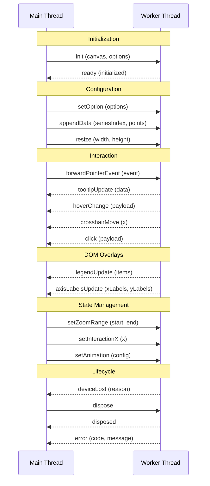

# Worker Communication Protocol

## Overview

The ChartGPU worker protocol enables GPU rendering in a Web Worker with OffscreenCanvas, keeping the main thread responsive during intensive rendering operations. Messages flow bidirectionally between main and worker threads, coordinating rendering, interaction, and DOM overlay updates.

**Benefits:**
- Main thread remains responsive during GPU rendering
- Parallel processing of render computations
- Separation of GPU operations from DOM updates

**Source:** See [`src/core/createRenderCoordinator.ts`](../../src/core/createRenderCoordinator.ts) for RenderCoordinator implementation and [`src/config/types.ts`](../../src/config/types.ts) for type definitions.

## Quick Start

**Import:** `chartgpu/worker` (future public export)

**Basic pattern:**

1. Main thread creates OffscreenCanvas and transfers to worker
2. Worker initializes RenderCoordinator with `domOverlays: false`
3. Main thread forwards pointer events to worker
4. Worker emits DOM overlay data via callbacks
5. Main thread renders DOM overlays (tooltips, legends, axis labels)

For a complete implementation guide, see [Worker Thread Integration Guide](../internal/WORKER_THREAD_INTEGRATION.md).

## Message Flow

## Inbound Messages (Main → Worker)

Messages sent from main thread to worker thread to control rendering and interaction.

### `init`

Initialize the worker with OffscreenCanvas and chart options.

| Field | Type | Required | Description |
|-------|------|----------|-------------|
| `type` | `'init'` | ✓ | Message type identifier |
| `chartId` | `string` | ✓ | Unique chart instance identifier |
| `messageId` | `string` | ✓ | Unique ID for request/response matching |
| `canvas` | `OffscreenCanvas` | ✓ | Transferred OffscreenCanvas from main thread |
| `devicePixelRatio` | `number` | ✓ | Device pixel ratio for high-DPI rendering |
| `options` | `ChartGPUOptions` | ✓ | Initial chart configuration |
| `gpuOptions` | `{ powerPreference?, requiredFeatures? }` | | Optional WebGPU initialization options |

**When to use:** First message after worker creation. Must await `ready` response before sending other messages.

**Transferables:** `canvas` (OffscreenCanvas is transferred, not cloned)

**Source:** See [`ChartGPUOptions`](../../src/config/types.ts)

### `setOption`

Update chart configuration (series, axes, theme, etc.).

| Field | Type | Required | Description |
|-------|------|----------|-------------|
| `type` | `'setOption'` | ✓ | Message type identifier |
| `chartId` | `string` | ✓ | Chart instance identifier |
| `messageId` | `string` | | Optional message ID for request/response correlation |
| `options` | `ChartGPUOptions` | ✓ | New chart options (merged with existing) |

**When to use:** Update chart appearance, add/remove series, change theme, modify axes.

**Source:** See [`ChartGPU.setOption()`](chart.md#chartgpuinstance)

### `appendData`

Append new data points to a single series (streaming).

| Field | Type | Required | Description |
|-------|------|----------|-------------|
| `type` | `'appendData'` | ✓ | Message type identifier |
| `chartId` | `string` | ✓ | Chart instance identifier |
| `seriesIndex` | `number` | ✓ | Zero-based series index |
| `data` | `ArrayBuffer` | ✓ | Transferred ArrayBuffer containing interleaved point data |
| `pointCount` | `number` | ✓ | Number of data points in the buffer |
| `stride` | `number` | ✓ | Bytes per point (e.g., 8 for [x, y], 20 for OHLC) |

**When to use:** Real-time data streaming for a single series. Use `appendDataBatch` for multiple series.

**Transferables:** `data` ArrayBuffer is transferred for zero-copy performance

**Source:** See [`ChartGPU.appendData()`](chart.md#chartgpuinstance) and [`DataPoint`](../../src/config/types.ts)

### `appendDataBatch`

Append new data points to multiple series (streaming).

| Field | Type | Required | Description |
|-------|------|----------|-------------|
| `type` | `'appendDataBatch'` | ✓ | Message type identifier |
| `chartId` | `string` | ✓ | Chart instance identifier |
| `items` | `ReadonlyArray<{ seriesIndex, data, pointCount, stride }>` | ✓ | Array of series updates with data buffers |

**When to use:** Batch multiple series updates into a single message for efficiency.

**Transferables:** All `items[].data` ArrayBuffers are transferred

**Source:** See [`DataPoint`](../../src/config/types.ts)

### `resize`

Update canvas dimensions when container size changes.

| Field | Type | Required | Description |
|-------|------|----------|-------------|
| `type` | `'resize'` | ✓ | Message type identifier |
| `chartId` | `string` | ✓ | Chart instance identifier |
| `width` | `number` | ✓ | New canvas width in CSS pixels |
| `height` | `number` | ✓ | New canvas height in CSS pixels |
| `devicePixelRatio` | `number` | ✓ | Device pixel ratio for high-DPI rendering |
| `requestRender` | `boolean` | | If true, immediately render after resize (default: false) |

**When to use:** Window resize, container resize, orientation change.

**Source:** See [`ChartGPU.resize()`](chart.md#chartgpuinstance)

### `forwardPointerEvent`

Forward normalized pointer events from main thread to worker for interaction.

| Field | Type | Required | Description |
|-------|------|----------|-------------|
| `type` | `'forwardPointerEvent'` | ✓ | Message type identifier |
| `chartId` | `string` | ✓ | Chart instance identifier |
| `event` | `PointerEventData` | ✓ | Pre-computed pointer event with grid coordinates |

**When to use:** Every pointer event (`move`, `click`, `leave`) captured on canvas.

**Source:** See [`PointerEventData`](interaction.md#pointereventdata) and [`RenderCoordinator.handlePointerEvent()`](../internal/WORKER_THREAD_INTEGRATION.md#worker-thread-forward-to-coordinator)

### `setZoomRange`

Set the x-axis zoom window (normalized [0, 1]).

| Field | Type | Required | Description |
|-------|------|----------|-------------|
| `type` | `'setZoomRange'` | ✓ | Message type identifier |
| `chartId` | `string` | ✓ | Chart instance identifier |
| `start` | `number` | ✓ | Normalized start position [0, 1] |
| `end` | `number` | ✓ | Normalized end position [0, 1] |

**When to use:** Programmatic zoom control, synchronized zoom across charts.

**Source:** See [`ChartGPU.setZoomRange()`](chart.md#chartgpuinstance)

### `setInteractionX`

Set the crosshair/tooltip x position (CSS pixels).

| Field | Type | Required | Description |
|-------|------|----------|-------------|
| `type` | `'setInteractionX'` | ✓ | Message type identifier |
| `chartId` | `string` | ✓ | Chart instance identifier |
| `x` | `number \| null` | ✓ | X coordinate in CSS pixels, or `null` to clear crosshair |
| `source` | `string` | | Optional source identifier to prevent echo (e.g., chart instance ID) |

**When to use:** Synchronized crosshairs across multiple charts, programmatic tooltip control.

**Source:** See [`ChartGPU.setInteractionX()`](chart.md#chartgpuinstance)

### `setAnimation`

Enable or disable animation, optionally updating animation configuration.

| Field | Type | Required | Description |
|-------|------|----------|-------------|
| `type` | `'setAnimation'` | ✓ | Message type identifier |
| `chartId` | `string` | ✓ | Chart instance identifier |
| `enabled` | `boolean` | ✓ | Whether animation is enabled |
| `config` | `AnimationConfig` | | Optional animation config to apply when enabling |

**When to use:** Enable/disable animations, adjust animation duration/easing.

**Source:** See [`AnimationConfig`](../../src/config/types.ts)

### `dispose`

Dispose worker resources and prepare for termination.

| Field | Type | Required | Description |
|-------|------|----------|-------------|
| `type` | `'dispose'` | ✓ | Message type identifier |
| `chartId` | `string` | ✓ | Chart instance identifier |

**When to use:** Before terminating the worker. Await `disposed` response before calling `worker.terminate()`.

## Outbound Messages (Worker → Main)

Messages emitted by worker thread to notify main thread of state changes and DOM overlay updates.

### `ready`

Initialization complete, worker ready to receive messages.

| Field | Type | Description |
|-------|------|-------------|
| `type` | `'ready'` | Message type identifier |
| `chartId` | `string` | Chart instance identifier |
| `messageId` | `string` | Matches `messageId` from `init` request |
| `capabilities` | `{ adapter: string, features: string[] }` | Optional GPU capabilities info for diagnostics |

**When emitted:** After successful initialization in response to `init` message.

### `rendered`

Frame render complete (optional diagnostic).

| Field | Type | Description |
|-------|------|-------------|
| `type` | `'rendered'` | Message type identifier |
| `chartId` | `string` | Chart instance identifier |
| `frameNumber` | `number` | Sequential frame counter |
| `timestamp` | `number` | Render timestamp in milliseconds |
| `deltaTime` | `number` | Time since last frame in milliseconds |
| `renderRequested` | `boolean` | True if render was triggered by explicit request (vs. animation tick) |

**When emitted:** After each `render()` call (optional, for performance monitoring).

### `tooltipUpdate`

Tooltip data changed (show, hide, or reposition).

| Field | Type | Description |
|-------|------|-------------|
| `type` | `'tooltipUpdate'` | Message type identifier |
| `chartId` | `string` | Chart instance identifier |
| `data` | `TooltipData \| null` | Tooltip content and position, or `null` to hide |

**When emitted:** Pointer movement over data points, pointer leave, data updates.

**Source:** See [`TooltipData`](../../src/config/types.ts) and [Worker Thread Integration](../internal/WORKER_THREAD_INTEGRATION.md#tooltip-updates)

### `legendUpdate`

Legend items changed (series added/removed, theme changed).

| Field | Type | Description |
|-------|------|-------------|
| `type` | `'legendUpdate'` | Message type identifier |
| `chartId` | `string` | Chart instance identifier |
| `items` | `ReadonlyArray<LegendItem>` | Array of legend items |

**When emitted:** `setOption()` changes series configuration or theme.

**Source:** See [`LegendItem`](../../src/config/types.ts) and [Worker Thread Integration](../internal/WORKER_THREAD_INTEGRATION.md#legend-updates)

### `axisLabelsUpdate`

Axis labels changed (zoom/pan, data updates, axis config changes).

| Field | Type | Description |
|-------|------|-------------|
| `type` | `'axisLabelsUpdate'` | Message type identifier |
| `chartId` | `string` | Chart instance identifier |
| `xLabels` | `ReadonlyArray<AxisLabel>` | X-axis tick labels and title |
| `yLabels` | `ReadonlyArray<AxisLabel>` | Y-axis tick labels and title |

**When emitted:** Every `render()` call (labels may change with zoom/pan).

**Source:** See [`AxisLabel`](../../src/config/types.ts) and [Worker Thread Integration](../internal/WORKER_THREAD_INTEGRATION.md#axis-label-updates)

### `hoverChange`

Hover state changed (pointer entered/left a data point).

| Field | Type | Description |
|-------|------|-------------|
| `type` | `'hoverChange'` | Message type identifier |
| `chartId` | `string` | Chart instance identifier |
| `payload` | `WorkerEventPayload \| null` | Hovered item details, or `null` when hover cleared |

**When emitted:** Pointer movement enters/leaves data points or pie slices.

**Source:** See [Event handling](interaction.md#event-handling)

### `click`

Click detected with hit test results.

| Field | Type | Description |
|-------|------|-------------|
| `type` | `'click'` | Message type identifier |
| `chartId` | `string` | Chart instance identifier |
| `payload` | `WorkerEventPayload` | Click coordinates and hit test results |

**When emitted:** When `forwardPointerEvent` with `type: 'click'` is received.

**Source:** See [`WorkerEventPayload`](../../src/worker/protocol.ts)

### `crosshairMove`

Crosshair x position changed.

| Field | Type | Description |
|-------|------|-------------|
| `type` | `'crosshairMove'` | Message type identifier |
| `chartId` | `string` | Chart instance identifier |
| `x` | `number` | X coordinate in CSS pixels |
| `source` | `string` | Optional source identifier to prevent echo in chart sync |

**When emitted:** Pointer movement in grid area, pointer leave, `setInteractionX()` calls.

**Source:** See [Worker Thread Integration](../internal/WORKER_THREAD_INTEGRATION.md#crosshair-movement)

### `zoomChange`

Zoom range changed (inside zoom interaction or programmatic).

| Field | Type | Description |
|-------|------|-------------|
| `type` | `'zoomChange'` | Message type identifier |
| `chartId` | `string` | Chart instance identifier |
| `start` | `number` | Normalized start position [0, 1] |
| `end` | `number` | Normalized end position [0, 1] |

**When emitted:** Wheel zoom, drag pan, `setZoomRange()` calls.

### `deviceLost`

GPU device lost, worker non-functional.

| Field | Type | Description |
|-------|------|-------------|
| `type` | `'deviceLost'` | Message type identifier |
| `chartId` | `string` | Chart instance identifier |
| `reason` | `'unknown' \| 'destroyed'` | Device loss reason code |
| `message` | `string` | Optional human-readable description |

**When emitted:** When `device.lost` promise resolves.

**Important:** Worker is non-functional after this event. Main thread should terminate worker and recreate if needed.

**Source:** See [Worker Thread Integration](../internal/WORKER_THREAD_INTEGRATION.md#gpu-device-loss)

### `disposed`

Worker disposal complete, safe to terminate.

| Field | Type | Description |
|-------|------|-------------|
| `type` | `'disposed'` | Message type identifier |
| `chartId` | `string` | Chart instance identifier |
| `cleanupErrors` | `ReadonlyArray<string>` | Optional array of non-fatal errors encountered during cleanup |

**When emitted:** After `dispose` message processed and resources cleaned up.

### `error`

Worker encountered an error.

| Field | Type | Description |
|-------|------|-------------|
| `type` | `'error'` | Message type identifier |
| `chartId` | `string` | Chart instance identifier |
| `messageId` | `string` | Optional messageId to correlate error with specific request |
| `code` | `'WEBGPU_INIT_FAILED' \| 'DEVICE_LOST' \| 'RENDER_ERROR' \| 'DATA_ERROR' \| 'UNKNOWN'` | Error category |
| `message` | `string` | Human-readable error description |
| `stack` | `string` | Optional stack trace for debugging |
| `operation` | `string` | Operation that failed (e.g., 'init', 'render', 'appendData') |

**Error codes:**

| Code | Description |
|------|-------------|
| `WEBGPU_INIT_FAILED` | WebGPU initialization failed (unsupported browser, adapter/device request failed) |
| `DEVICE_LOST` | GPU device lost during operation (see `deviceLost` message) |
| `RENDER_ERROR` | Error occurred during render pass |
| `DATA_ERROR` | Data processing or buffer operation failed |
| `UNKNOWN` | Unclassified error |

**When emitted:** Initialization failure, invalid message, runtime errors.

## Transferable Objects

Transferable objects enable zero-copy data transfer between threads for performance. The protocol uses transferables for:

### OffscreenCanvas Transfer

**Used in:** `init` message

**Pattern:**

Main thread transfers canvas control to worker, preventing main thread from drawing to it.

### ArrayBuffer Transfer

**Used in:** `appendData`, `appendDataBatch`

**Pattern:**

When `points` are backed by typed arrays (e.g., `Float32Array`), the underlying `ArrayBuffer` can be transferred for zero-copy performance.

**Helper:** `getTransferables(message)` extracts transferable objects from a message (future utility).

**Important:** Transferred objects become unusable in the sender thread. Clone data if sender needs to retain it.

## Request/Response Pattern

### `messageId` for Async Operations

Some operations require waiting for worker response. Use `messageId` to match requests with responses.

**Required for:**
- `init` → `ready` (must await before sending other messages)

**Optional for:**
- Other operations can use fire-and-forget pattern

**Pattern:**

Main thread generates unique `messageId` and includes in request. Worker includes same `messageId` in response.

### Example: Initialization

Main thread:

1. Generate unique `messageId` (e.g., UUID)
2. Send `init` message with `messageId`
3. Set up one-time message listener for `ready` with matching `messageId`
4. Await response before sending other messages

Worker thread:

1. Receive `init` message
2. Initialize RenderCoordinator
3. Send `ready` message with same `messageId`

## Error Handling

### Error Codes

| Code | Recovery Strategy |
|------|------------------|
| `WEBGPU_INIT_FAILED` | Check WebGPU support, show fallback UI |
| `DEVICE_LOST` | Terminate and recreate worker, notify user |
| `RENDER_ERROR` | Log error, check GPU state, consider worker restart |
| `DATA_ERROR` | Validate data format, check buffer sizes and stride values |
| `UNKNOWN` | Log error, consider worker restart |

### Device Loss Handling

GPU devices can be lost due to driver crashes, timeouts, or system events. When this occurs:

1. Worker emits `deviceLost` message with reason
2. Worker becomes non-functional (cannot render)
3. Main thread should terminate worker and recreate if needed
4. **Do not** send `dispose` message after `deviceLost` (worker already disposed)

**Source:** See [Worker Thread Integration - Device Loss](../internal/WORKER_THREAD_INTEGRATION.md#gpu-device-loss)

### Error Message Handling

When worker emits `error` message:

1. Log error to console with code, message, and stack trace
2. Display user-friendly error UI if appropriate
3. Consider terminating and recreating worker for critical errors
4. For `DATA_ERROR`, validate data buffers and retry with correct format

## Related Documentation

- [Worker Thread Integration Guide](../internal/WORKER_THREAD_INTEGRATION.md) - Complete implementation guide
- [RenderCoordinator Callbacks](../internal/WORKER_THREAD_INTEGRATION.md#rendercoordinatorcallbacks) - Callback interface details
- [PointerEventData](interaction.md#pointereventdata) - Pre-computed pointer event format
- [Event handling](interaction.md#event-handling) - Chart interaction events
- [Chart API](chart.md) - Chart instance methods
- [Types](../../src/config/types.ts) - Type definitions

## Summary

The ChartGPU worker protocol provides a message-based interface for offloading GPU rendering to Web Workers:

- **Initialization:** Transfer OffscreenCanvas and options via `init` message
- **Configuration:** Update chart via `setOption`, `appendData`, `resize`, etc.
- **Interaction:** Forward pointer events, receive hover/click/crosshair updates
- **DOM Overlays:** Receive tooltip, legend, and axis label data for main thread rendering
- **Error Handling:** Handle initialization failures, device loss, and runtime errors
- **Performance:** Use transferables for zero-copy data transfer
- **Lifecycle:** Clean up with `dispose` message before worker termination

For implementation examples and best practices, see the [Worker Thread Integration Guide](../internal/WORKER_THREAD_INTEGRATION.md).
